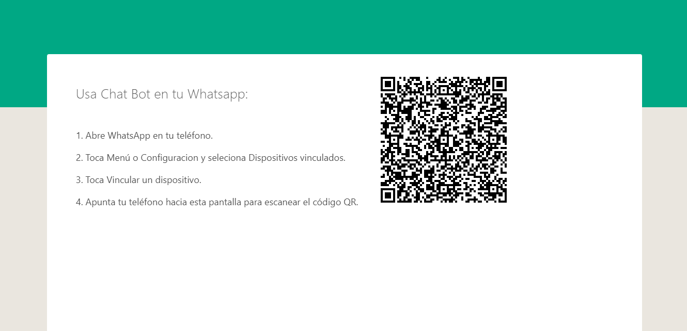
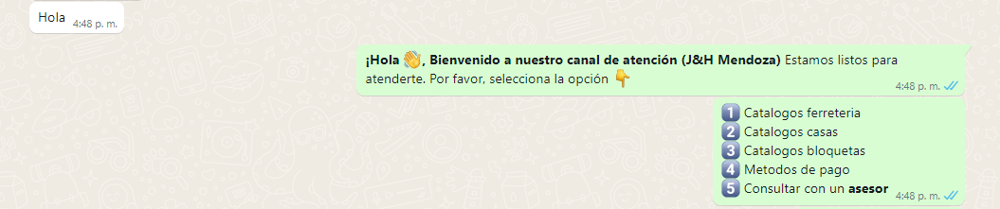

Integrantes del grupo:

Guillermo Daniel Santiago Quispe

Fabrizio Santiago Zuñiga Arivilca

Descripción del Proyecto:
Crear un bot de WhatsApp que puede responder a las interacciones de los usuarios.

VER: https://hostnation.store/chatbot/

1. Requisitos previos:
Antes de comenzar, asegúrate de tener instalado Node.js en tu sistema. Puedes descargarlo e instalarlo desde https://nodejs.org.

2. Configuración del proyecto:

-Crea un nuevo directorio para tu proyecto y abre una terminal en ese directorio.

-Inicializa un nuevo proyecto de Node.js ejecutando el siguiente comando, este comando creará un archivo package.json en tu directorio.

    npm init -y
  
-Instala las dependencias necesarias ejecutando el siguiente comando:

    npm install @bot-whatsapp/bot @bot-whatsapp/portal @bot-whatsapp/provider/baileys @bot-whatsapp/database/mock
  
-Esto instalará los paquetes necesarios para crear el bot de WhatsApp.

3. Creación del archivo index.js:

Crea un archivo llamado index.js en el directorio raíz de tu proyecto y copia el siguiente código en ese archivo

    const { createBot, createProvider, createFlow, addKeyword } = require('@bot-whatsapp/bot');
    
    const QRPortalWeb = require('@bot-whatsapp/portal');
    
    const WsProvider = require('@bot-whatsapp/provider/baileys');
    
    const MockAdapter = require('@bot-whatsapp/database/mock');

// Aquí se definen los flujos de conversación y las respuestas del bot

    const flowPDFProductos = addKeyword('1').addAnswer('Este mensaje envía una imagen', {

    media: 'https://hostnation.store/pdf/catalogos_producto.pdf',
    
    }).addAnswer(
    [
    
        "Te envié el catálogo de ferretería en PDF ☝\n*Elige otras opciones:*",
        
        "2️⃣ Catálogos casas",
        
        "3️⃣ Catálogos bloquetas",
        
        "4️⃣ Métodos de pago",
        
        "5️⃣ Consultar con un *asesor*"
        
    ],
    {
        capture: true
    },
    (ctx, flow) => {
        if (ctx.body === '2') {
            flow.gotoFlow(flowPDFCasas);
        } else if (ctx.body === '3') {
            flow.gotoFlow(flowPDFBloquetas);
        } else if (ctx.body === '4') {
            flow.gotoFlow(flowMetodoPagos);
        } else if (ctx.body === '5') {
            flow.gotoFlow(flowAsesor);
        }
    });

// Define los demás flujos de conversación aquí...

     const flowPrincipal = addKeyword(['hola', 'buenas', 'ola', 'consulta', 'hello', 'que tal', 'pregunta'])

    .addAnswer('*¡Hola* 👋*,* *Bienvenido a nuestro canal de atención* *(J&H Mendoza)* Estamos listos para atenderte. Por favor, selecciona la opción 👇')
    
    .addAnswer(
    
        [
            '1️⃣ Catálogos ferretería',
            
            '2️⃣ Catálogos casas',
            
            '3️⃣ Catálogos bloquetas',
            
            '4️⃣ Métodos de pago',
            
            '5️⃣ Consultar con un *asesor*'
            
        ],
        null,
        null,
        [flowPDFProductos, flowPDFCasas, flowPDFBloquetas, flowMetodoPagos, flowAsesor]
    );

    const main = async () => {
    const adapterDB = new MockAdapter();
    
    const adapterFlow = createFlow([flowPrincipal]);
    
    const adapterProvider = createProvider(WsProvider);
    
    createBot({
    
        flow: adapterFlow,
        provider: adapterProvider,
        database: adapterDB,
    });
    QRPortalWeb({
        port: 3000 // Puerto en el que se ejecutará el portal web del bot
    });

    };

    main();

4. Ejecución del bot:

-Desde la terminal, ejecuta el siguiente comando para iniciar el bot de WhatsApp:
 
       node index.js
 
El bot se iniciará y comenzará a escuchar las interacciones de los usuarios.

-Verás un mensaje en la terminal con el texto "¡Hola! Bienvenido a nuestro canal de atención (J&H Mendoza). Estamos listos para atenderte. Por favor, selecciona la opción" seguido de las opciones disponibles.

-Puedes utilizar un dispositivo móvil para escanear el código QR que se muestra en la terminal. Esto iniciará una sesión de WhatsApp en el dispositivo y podrás interactuar con el bot.

-El bot responderá según las palabras clave que hayas definido en los flujos de conversación. Puedes personalizar y agregar más flujos y respuestas según tus necesidades.
